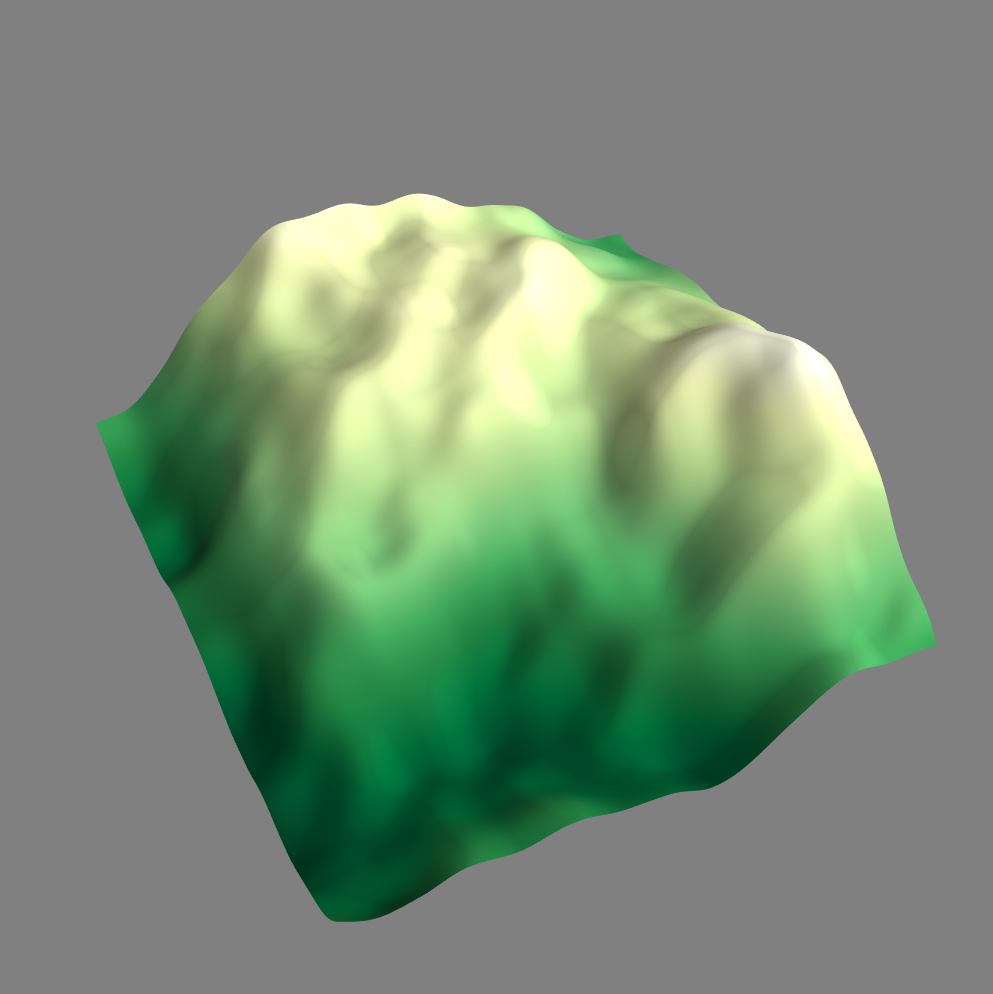
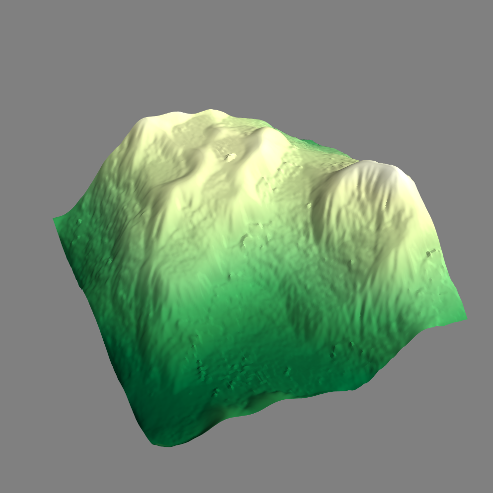

# Hydraulic Erosion Simulation

###### Processing heightmaps for simulated droplet-based erosion.

<p id="img_cont">
    
    
</p>

_Above: the unprocessed fractal noise and the same map after 50,000 droplets_

Creating procedural terrain from heghtmaps is easily done with [classical noise generators](https://github.com/csaddison/Perlin-Noise) and fractal noise, however making that terrain look realistic is often much harder. Depending on how many octaves you use, proceduarly generated terrain is either too smooth or too jagged to look realistic. Natural terrain has a combination of these features, with rocky mountains and flatter rolling plains. A leading cause of this is the natural erosion of the terrain over time, especially due to rivers and rainfall. By simulating thousands of rain droplets we can compute the movement of the water accross the land and erode and deposit sediment as the drop travels. This leads to realistic erosion patterns, especially in hilly regions, and realisitc valleys in between them. This project is largely a pythonic implementation of the hydraulic erosion algorithm described [here](https://www.firespark.de/resources/downloads/implementation%20of%20a%20methode%20for%20hydraulic%20erosion.pdf).

[//]: # (**Note: Editable parameters are in the parameters.py file, don't touch anything else yet or it may not work.**)

-------------------------------------
## Contents
- [Dependencies](#dependencies)
- [Implementation](#implementation)
    - [Parameters](#parameters)
    - [Map and Droplet Generation](#map-and-droplet-generation)
    - [Gradients and Movement](#gradients-and-movement)
    - [Sediment Capacity](#sediment-capacity)
    - [Erosion](#erosion)
    - [Deposition](#deposition)
    - [Post Processing](#post-processing)
- [Changes](#changes)

-------------------------------------
## Dependencies

These scripts require you to have numpy and scipy (pretty standard) but also require the 3D pipeline toolkit [Mayavi](https://docs.enthought.com/mayavi/mayavi/).

-------------------------------------
## Implementation

###### Parameters

**Map Parameters**
- `noise_scale`: The size of the noise in the first octave. Lower = bigger. Powers of 2 work best.
- `terrain_reolution`: The resolution of the terrain map. Powers of 2 work best.
- `noise_octaves`: The number of "layers" in the fractal noise.
- `noise_lacunarity`: The power to which the scale increases each octave. Powers of 2 work best.
- `noise_persistance`: The factor of which the amplitude of each octave is reduced. `float` between 0-1.
- `map_seed`: The seed for the noise generator.

**Rain Parameters**
- `drop_iterations`: The number of random droplets created.
- `drop_move_cap`: The maximum number of movement steps for each drop.
- `drop_initial_water`: The initial water level of each drop pre-evaporation.
- `rain_seed`: The seed for the initial droplet positions.
- `rain_initial_vel`: Initial velocity for all of the rain drops. Allows you to approximately simulate wind-driven rain. `tuple`

**Movement Parameters**
- `world_gravity`: The rate the droplets accelerate when moving down/uphill.
- `drop_momentum`: A `float` between 0-1 dictating how much the drop responds to the terrain. A value of 1 means the drop never changes direction and a value of 0 means the drop moves directly downhill with no "memory".
- `water_cuttoff`: Drops with water levels below this value will cease to exist. `float` generally close to 0.

**Erosion Parameters**
- `erosion_rate`: A `float` between 0-1 dictating how much erosion ability the drops have. A value of 1 means the drop fills as much of its carrying capacity as it can each time step and a value of 0 means no erosion.
- `sediment_capacity_multiplier`: A factor regulating how much sediment a drop can carry.
- `deposition_rate`: A `float` between 0-1 dictating how much sediment is deposited each time step. If the value is 1 then the drop deposits all of the sedument it carries when it encounters a pit. Low values are more realistic.
- `erosion_radius`: An `int` radius of points that lose sediment around an eroded point. Helps prevent narrow ravines that would crumble in real life, but be careful: this currently works as a nested for-loop and is computationally expensive (it has to run everytime the drop erodes the terrain.) A reasonable value on a 256x256 map is ~4 cells.
- `min_slope_capacity`: A `float` that prevents the carrying capacity from dropping straight to zero when a drop encounters flatter terrain. Scale it in relation to the range of your heightmap as it is used in comparison to the  of the drops movement.

**Render Parameters**
- `map_colormap`: The colormap for the output, default is 'YlGn' since it emulates terrain colors.
- `map_z_scale`: The height of the output. Use it with `map_board_scale` to scale any sized terrain.
- `map_board_scale`: The length/width of the output. Use it with `map_z_scale` to scale any sized terrain.
- `processing_blur`: The radius of the gaussian blur applied to the output after erosion. Default is 1.

###### Map and Droplet Generation

In order to simulate terrain erosion we obviously first need terrain to erode. Any heightmap can be used, with these examples using 8-bit maps (0-255). This approach focuses on processing procedurally generated terrain, but another interesting application of this algorithm is to make hand-drawn heightmaps more lifelike. The procedural terrain comes from layered Perlin noise using a [homemade noise script](https://github.com/csaddison/Perlin-Noise) and the syntax:

``` python
fractal_noise = noise.Octave(resolution, num_of_octaves, major_grid_scale, falloff, seed)
```

After creating the terrain we create the droplets from a random list of  positions on our board:

``` python
drops = np.random.rand(p_num_drops, 2)
```

And continue our calculations for every drop in our number of iterations `p_num_drops`. For each drop during each time step we store its current position `pos_0` (a float); and its current cell on the map `index_0` (an integer). In general the index is just the position rounded to the nearest integer.

###### Gradients and Movement

For each droplet we want it to move downhill across ou-r terrain, picking up and depositing sediment in a realistic manner. The first step is getting it moving downhill. We take the mathematical gradient of our terrain using:

``` python
uy, ux = np.gradient(ermap)
grad = np.array([uy[index_0], ux[index_0]])
```

then for each time step we move the droplet according to:

<p align="center"></p>

A `k_momentum` value of 1 means the droplet never changes beyond its initial velocity (often zero), and a value of 0 means the drop always moves directly downhill with no "memory". After calculating the velocity we update the droplets position. However, we don't want to move the droplet proportionally to its speed because a fast drop could then "skip over" cells, climbing impassable obstacles and not eroding the transversed terrain. So we'll normalize the velocity when we add it to the position:

```python
norm_vel = np.linalg.norm(vel)
pos_t = pos_0 + vel / norm_vel
```

The final step is to evaporate some of the drop after it has finished moving and eroding during a time step. This can be done with an evaporation rate or, in this case, by setting a movement cap such that:

<p align="center"></p>

###### Sediment Capacity

Every step the droplet takes one of two actions: either eroding sediment or depositing sediment. This decision depends on the current sediment level of the drop in comparison to the calculated carrying capacity. The controlling equation is:

<p align="center"></p>

where  is the `sediment_capacity_multiplier`. This works well in steep areas. From  we know that when moving downhill  is negative so, along with our increase in speed, our carrying capacity goes up. However in flat terrain as  the capacity also declines towards zero. Adding a clamp at a `min_slope_capacity` allows the drop to always hold at least a little sediment as it crosses flatter terrain:

<p align="center"></p>

###### Erosion

When a drop moves to a new cell and has less sediment than its maximum capacity it will erode the terrain, taking sediment from its old cell as well as neighboring cells in a specified radius. How much sediment is eroded is proportional to a drops carrying capacity and how much sediment it is currently carrying:

<p align="center"></p>

Where  is the the erosion rate. One improvement to add to this would be to allow  to vary throughout the terrain, forming patches of harder or softer rock. This could lead to interesting natural features such as canyons and waterfalls. One thing to note is that we never want to erode more sediment than the  of the drop, so we add:

<p align="center"></p>

###### Deposition

Depositing sediment is easier than erosion. When the drop is has more sediment than its carrying capacity allows it will deposit a fraction of its sediment according to the equation:

<p align="center"></p>

Where  is a constant corresponding the the rate. A rate of 1 means it drops all of its extra sediment in one time step. Since this implementation doesn't have bilinear interpolation yet the sediment is simply deposited on the index position of the drop. Thats also why there are currently bumps on the surface--the deposition get dropped on the same node multiple times before it moves to a new cell.

###### Post Processing

The 3D rendering is handled by the Mayavi library although the eroded heightmap could easily be rendered by matplotlib. My next attempt will probably utilize a JavaScript approach to a 3D webapp. The only processing done pre-render is a slight blur from the `scipy.ndimage.filters.gaussian_filter` function. The main purpose of the blur is to smooth deposition errors.

-------------------------------------
## Changes

As of 6/24/2019 the code is working but not pretty. Some aspects from the paper have been neglected, such as bilinear interpolation of the gradients and bilinear interpolation on sediment distribution. Instead (mostly due to lack of patience) I've opted for the easier solution of slightly blurring the erosion map after deposition.

The biggest changes coming for this project are to:

* Fix the weights on the erosion radius
* Try and implement smoother deposition

But mainly:

* Refactor into a `drop` class

Setting up a drop as its own class would make tracking drop variables (water level, sediment level, carrying capacity, speed, position, etc.) easier and more intuative; and the movement, erosion, and deposition functions could be refactored as class methods. This opens up the possibility for selecitvely applying the methods (especailly the evaporation method) to introduce rivers and other water sources.